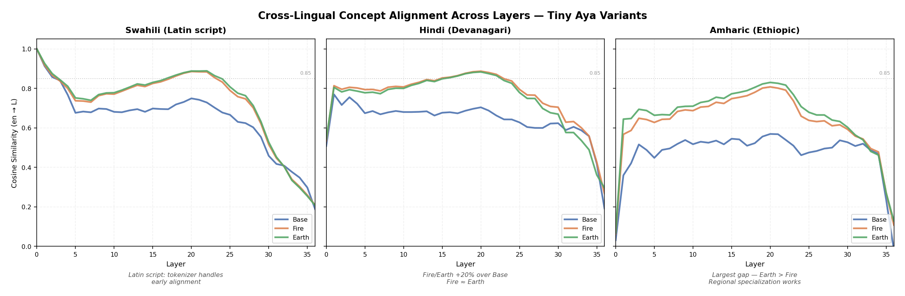

# Tiny Aya Builds Shared Concepts Mid-Network Then Destroys Them at Output Layers — And Regional Fine-Tuning Determines How Well It Builds Them

**Saumil Srivastava**

February 2026

---

## Abstract

Multilingual language models are increasingly deployed in low-resource health information systems, yet we lack mechanistic understanding of how regional fine-tuning affects cross-lingual concept representations. We apply layer-wise residual stream cosine similarity analysis to three variants of Tiny Aya (Base, Fire, Earth) — a 3.35B-parameter multilingual model family — across 20 medical concepts in 10 languages. We extract hidden states at every transformer layer using HuggingFace Transformers (`output_hidden_states=True`) and measure cosine similarity between English and each target language to construct cross-lingual alignment curves.

We find a universal **rise-peak-collapse** architecture: all variants build cross-lingual concept alignment through mid-network layers (peaking at L18-20), then destroy it at the final layers (L33-36). Regional fine-tuning does not shift when alignment occurs but rather *how much* alignment the model builds. For non-Latin-script languages, Fire and Earth achieve 12-40% higher peak cosine similarity than Base — with Hindi rising from 0.77 to 0.89 (+15%) and Amharic from 0.59 to 0.83 (+40%). Earth shows a slight numerical advantage over Fire for Amharic (0.83 vs 0.81), though the difference is too small to draw conclusions without significance testing. For most Latin-script languages (Swahili, French, Spanish), all variants show near-maximal alignment at the embedding layer — a tokenizer artifact, not a learned representation. Yoruba is a notable exception: despite using Latin script, it does not consistently reach embedding-level alignment, suggesting that script overlap is necessary but not sufficient for tokenizer-driven alignment.

## 1. Motivation

Production multilingual systems serving community health workers (CHWs) face a fundamental routing problem: given user input in one of dozens of possible languages, which model variant should process it? Regional variants like Tiny Aya Fire (South Asia) and Earth (Africa) are fine-tuned for specific language families, but the internal effect of this fine-tuning on concept representation is unknown.

Two competing hypotheses frame the question:

**Hypothesis A (Language-Agnostic Concepts):** Fine-tuning creates shared concept representations earlier in the network. A Hindi input processed by Fire would converge to the same internal representation as its English equivalent by layer 12-16, rather than layer 24+ in Base. This would mean Fire genuinely "understands" Hindi medical concepts better.

**Hypothesis B (Surface-Level Routing):** Fine-tuning primarily improves surface-level token processing (better tokenization, more familiar subword units) but does not change the layer at which cross-lingual concept alignment occurs.

Our results support neither hypothesis cleanly. Fine-tuning improves the *depth* of cross-lingual alignment without shifting *when* it occurs — a pattern not anticipated by either hypothesis.

## 2. Methodology

### 2.1 Models

We analyze three Tiny Aya variants (approximately 3.35 billion parameters each), a model family built on the Cohere2 architecture. The base model is pretrained from scratch on 6T tokens; Fire and Earth are derived from Base through region-specific supervised fine-tuning and model merging with a globally-tuned variant (Salamanca et al., 2026):

| Variant | Target Region | Languages Emphasized |
|---------|---------------|---------------------|
| Base | Global | Broad multilingual coverage |
| Fire | South Asia | Hindi, Bengali, Tamil, and related |
| Earth | Sub-Saharan Africa | Swahili, Amharic, Yoruba, and related |

All three variants share the same Cohere2 transformer architecture: 36 layers, hidden dimension 2048, 16 query attention heads with 4 key-value heads (grouped query attention), and interleaved sliding window attention (pattern of 4, i.e., every 4th layer uses sliding window attention with a 4096-token window). The 3.35B parameter count with a relatively small hidden dimension is driven by the large multilingual vocabulary (262,144 tokens), which accounts for a substantial fraction of total parameters. They differ in regional fine-tuning data and model merging strategy (Salamanca et al., 2026).

### 2.2 Stimuli

**Concept probes (200 stimuli):** 20 medical concepts translated into 10 languages (English, Hindi, Bengali, Swahili, Amharic, French, Spanish, Arabic, Yoruba, Tamil). Each translation is a complete declarative sentence with the same semantic structure. Categories span symptoms (fever, cough, diarrhea, pain), entities (child, mother, doctor, medicine, hospital, water, newborn), actions (breathing, eating, sleeping), severity (dangerous), states (sick, healthy), and diseases (malaria, infection, dehydration).

Concept probe translations were authored with reference to FLORES-200 parallel sentences and hand-verified for semantic equivalence across all 10 languages. Full sentences rather than isolated tokens are used because transformer residual streams require sufficient context for stable cross-lingual representations.

### 2.3 Residual Stream Analysis

We extract residual stream activations at every layer (embedding layer through layer 36, yielding 37 activation vectors per stimulus) using HuggingFace Transformers with `output_hidden_states=True`. For each stimulus, the activation at layer $l$ is the residual stream vector $\mathbf{r}_l \in \mathbb{R}^{2048}$ at the last token position.

### 2.4 Cross-Lingual Alignment Metric

For each concept $c$, language pair $(en, L)$, variant $v$, and layer $l$, we compute:

$$\text{alignment}(c, L, v, l) = \frac{\mathbf{r}_l^{(c, en, v)} \cdot \mathbf{r}_l^{(c, L, v)}}{\|\mathbf{r}_l^{(c, en, v)}\| \cdot \|\mathbf{r}_l^{(c, L, v)}\|}$$

This produces an alignment curve: a vector of 37 cosine similarity values showing how cross-lingual alignment evolves from embedding to output.

## 3. Results

### 3.1 A Note on Tokenizer Artifacts

Before presenting alignment curves, we note that six of ten languages (Swahili, French, Spanish, Yoruba, Arabic, Tamil) show 1.0 cosine similarity at layer 0 — before any model computation. This is a **tokenizer artifact**: shared subword vocabulary between English and these languages produces identical or near-identical embeddings. Latin-script languages share tokens directly; Arabic and Tamil show the same pattern, likely due to the tokenizer's deliberate language-bucket weighting scheme that ensures equitable compression across scripts (Salamanca et al., 2026, Section 2.1).

Any claim about cross-lingual alignment must distinguish tokenizer-driven alignment (a property of the tokenizer) from model-learned alignment (a property of the transformer). All analysis of model-learned alignment focuses on Hindi, Bengali, and Amharic, where different scripts mean the model must learn alignment from scratch.

### 3.2 The Rise-Peak-Collapse Architecture

The primary finding is structural: all three variants follow the same **rise-peak-collapse** pattern for non-Latin-script languages, but Fire and Earth build substantially higher peaks.

*Figure 1. Cross-lingual alignment curves (cosine similarity to English) averaged across 20 medical concepts. Left: Swahili (Latin script) shows trivial 1.0 alignment from layer 0 — a tokenizer artifact. Center: Hindi shows Fire/Earth peaking at 0.88-0.89 vs Base at 0.77. Right: Amharic shows the largest gains, with Earth (0.83) outperforming Fire (0.81) and Base (0.59).*

**Three stories emerge from three languages:**

**Swahili (Latin script overlap).** All variants start at 1.0 alignment thanks to shared Latin-script tokenization. Through mid-layers, Fire and Earth maintain ~0.10-0.14 higher similarity than Base (e.g., 0.89 vs 0.75 at L20), showing that regional fine-tuning still provides some benefit even with Latin-script overlap. However, the variant gap is substantially smaller than for non-Latin scripts, and all three converge during the final-layer collapse (L33-36).

**Hindi (Fire/Earth build ~15% more alignment).** Base plateaus at 0.68-0.77 cosine similarity from layers 4-20. It builds *some* shared representation but never achieves strong alignment. Fire and Earth climb steadily from layer 4 to layer 20, peaking at 0.88-0.89 — approximately 15% higher than Base. All variants start at ~0.52 (Devanagari vs Latin embeddings are dissimilar, as expected) and all collapse to 0.19-0.30 at the final layers (L33-36).

**Amharic (Earth > Fire, regional specialization).** Amharic is the hardest case: zero tokenizer overlap with English, starting near 0.03-0.07 at layer 0. Base peaks at only 0.57. Fire reaches 0.81 and Earth reaches 0.83 — a +40% improvement over Base. Earth shows a slight numerical advantage over Fire for Amharic (0.83 vs 0.81). Whether this reflects regional data composition or noise is unclear given the small difference and absence of significance testing.

### 3.3 Peak Alignment by Language

| Language | Script | Base Peak | Fire Peak | Earth Peak | Improvement |
|----------|--------|-----------|-----------|------------|-------------|
| Hindi | Devanagari | 0.774 | 0.889 | 0.885 | +15% |
| Bengali | Bengali | 0.772 | 0.866 | 0.856 | +12% |
| Amharic | Ethiopic | 0.592 | 0.809 | 0.832 | +40% |
| Swahili | Latin | 1.000 | 1.000 | 1.000 | 0% |
| French | Latin | 1.000 | 1.000 | 1.000 | 0% |
| Spanish | Latin | 1.000 | 1.000 | 1.000 | 0% |
| Arabic | Arabic | 1.000 | 1.000 | 1.000 | 0% |
| Yoruba | Latin | 1.000 | 1.000 | 1.000 | 0% |
| Tamil | Tamil | 1.000 | 1.000 | 1.000 | 0% |

*Improvement = best fine-tuned variant (Fire or Earth) peak over Base peak. For languages showing 0% improvement, the peak occurs at layer 0 (a tokenizer artifact — see Section 3.1). This metric does not capture mid-layer differences; for example, Swahili shows a ~0.14 Fire/Earth advantage over Base at L20 despite identical layer-0 peaks.*

Languages fall into two tiers: those with tokenizer-driven 1.0 alignment at layer 0 (see Section 3.1), and those where the model must learn alignment from scratch (Hindi, Bengali, Amharic).

### 3.4 Final-Layer Collapse

All variants show dramatic collapse at the final 4 layers (L33-36), regardless of how much alignment they built in mid-layers.

Hindi final-layer similarity:
- Base: 0.19
- Fire: 0.27
- Earth: 0.30

Amharic final-layer similarity:
- Base: -0.02
- Fire: 0.11
- Earth: 0.13

This means the model's output representations are **not** language-agnostic. Even for concepts that are highly aligned at layer 20, the model re-separates them by language at the final layers. The final layers learn language-specific output distributions (different vocabularies, grammar patterns) while mid-layers learn shared semantics.

**Implication for routing:** If a downstream system uses final-layer embeddings for language detection or routing, the model will always appear language-specific. Cross-lingual alignment only exists in the hidden layers.

### 3.5 Commitment Layer Analysis

We defined a "commitment layer" as the first layer where alignment exceeds 0.85 for three consecutive layers, as part of our pre-specified analysis criteria. This metric, while useful for quick comparison, should be interpreted with caution since the 0.85 threshold is arbitrary.

At the 0.85 threshold, Base never commits for Hindi (peak is 0.77) while Fire commits at layer 11-19 depending on concept. This makes Base look categorically different from Fire, but the reality is a continuous ~15% improvement in peak similarity, not a qualitative shift.

For Amharic, neither Base nor Fire consistently commit, but Earth reaches commitment for select concepts (e.g., fever at L19, breathing at L18, dehydration at L18). The overall Earth > Fire difference is small, however, and should be interpreted cautiously.

## 4. Implications for Routing Architecture

These findings inform the language routing system:

1. **Route based on script, not just language.** For most Latin-script languages, routing to a regional variant adds no measurable value — alignment is already near-maximal. Regional routing matters primarily for non-Latin scripts (Devanagari, Bengali, Ethiopic). Note that Yoruba is an exception among Latin-script languages, indicating that low-resource Latin-script languages may still benefit from routing.

2. **Don't route based on final-layer embeddings.** Cross-lingual alignment lives in mid-layers (L18-20) only. Final-layer representations are language-specific by design.

3. **Earth shows a slight edge for Amharic.** Earth numerically outperforms Fire for Amharic (0.83 vs 0.81), though the difference is small. For the lowest-resource scripts, the regional variant may provide marginally better alignment, but this requires further validation.

4. **Detect code-switching before routing.** Mixed-language inputs are adversarial to regional variants. If a sub-sentence classifier detects multiple languages, route to Base. *(This recommendation is motivated by the failure taxonomy and engineering constraints, not directly evidenced by the alignment curves.)*

5. **Maintain a formal terminology watchlist.** Inputs containing WHO-standard or pharmaceutical terminology should route to Base, even when the surrounding language matches a regional variant. *(As with point 4, this is an engineering recommendation from the failure taxonomy, not a finding from the alignment analysis.)*

## 5. Limitations

This study has several important limitations that constrain the generalizability of its findings.

**Cosine similarity is not functional equivalence.** Cosine similarity measures geometric proximity in the residual stream, not functional equivalence. Two representations can be geometrically close but functionally different if the downstream attention heads use orthogonal subspaces. Our metric is a necessary but not sufficient condition for shared concept representation. A stronger test would involve causal interventions (activation patching), which we leave for future work.

**The 0.85 threshold is arbitrary.** The commitment layer metric is highly sensitive to threshold choice. At 0.75, Base commits for 8 of 20 Hindi concepts. At 0.90, Fire only commits for 10 of 20. We report peak similarity values alongside commitment layers to reduce dependence on this threshold, but readers should interpret commitment layer numbers as one perspective, not a definitive measure.

**Small concept sample (N=20).** These 20 medical concepts may not represent the model's general cross-lingual behavior. The patterns observed may not extend to other domains (legal, educational, agricultural) or even to other medical sub-domains (mental health, surgical, pharmacological).

**Last-token extraction.** We extract activations at the last token position. Different extraction strategies (first token, mean-pooling across positions) could show different patterns. Position-specific analysis would require a different experimental design.

**No causal evidence.** Cosine similarity curves show correlation, not causation. We observe that mid-layer representations are geometrically aligned but cannot claim the model functionally *uses* these aligned representations for downstream computation. Causal intervention studies (e.g., activation patching) would be needed to establish a functional role.

**Latin-script 1.0 values are tokenization artifacts.** The 1.0 similarity at layer 0 for Latin-script languages is not a model-learned representation. Any analysis treating layer-0 commitment as evidence of model capability is misleading. We explicitly separate tokenizer-driven alignment from model-learned alignment in our analysis.

**Fire and Earth are surprisingly similar.** Fire and Earth produce nearly identical alignment curves for most languages (within 0.01-0.03 at every layer), despite being fine-tuned on different regional data. Both Fire and Earth are merged with a shared globally-tuned model (Salamanca et al., 2026), which may account for their similarity more than data composition. The Earth > Fire advantage for Amharic is the one exception, but at +0.02 it is small.

**Grouped query attention.** Tiny Aya uses grouped query attention (16 query heads, 4 key-value heads). Our analysis treats the residual stream as a single vector and does not distinguish behavior across GQA head groups, which may exhibit different cross-lingual attention patterns.

**Interleaved sliding window attention.** Tiny Aya uses a Cohere2 architecture with interleaved sliding window attention (SWA) at every 4th layer (pattern of 4). Hidden states at SWA layers reflect locally-constrained attention with a 4096-token window, which may affect mid-layer alignment measurements differently than full attention layers. We do not distinguish between SWA and full-attention layer measurements in this analysis.

## References

1. NLLB Team et al. (2022). No Language Left Behind: Scaling Human-Centered Machine Translation. arXiv:2207.04672. (FLORES-200)

2. Aryabumi, V., et al. (2024). Aya Expanse: Connecting the Global Majority. CohereForAI technical report.

3. Elhage, N., et al. (2021). A Mathematical Framework for Transformer Circuits. Anthropic. (Establishes residual stream decomposition as a framework for mechanistic analysis)

4. Wendler, C., et al. (2024). Do Llamas Work in English? On the Latent Language of Multilingual Transformers. arXiv:2402.10588. (Related work on multilingual internal representations)

5. Wolf, T., et al. (2020). HuggingFace's Transformers: State-of-the-art Natural Language Processing. arXiv:2003.10555. (Activation extraction framework)

6. Salamanca, A.R., et al. (2026). Tiny Aya: Bridging Scale and Multilingual Depth. Cohere/Cohere Labs technical report. (Architecture details, tokenizer design, region-specialized training via SimMerge)
